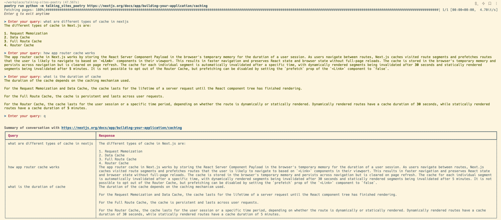

# Talking Sites with LLM

Leveraging the power of LLM (Language Models) and the `langchain` library, our script offers a state-of-the-art solution to interactively query the content of a given URL. It processes the content of the web page, embeds it into a semantic space, and then allows for real-time querying of the embedded content using advanced LLMs.



## Features:

- **Semantic Search**: Instead of relying on keyword-based searches, this tool employs semantic understanding, allowing users to query contextually and receive more relevant answers.
  
- **Interactive CLI**: A user-friendly command-line interface that facilitates dynamic interactions.

- **Rich Text UI**: Using the `rich` library, the CLI provides visually appealing output that enhances user experience.

- **End-to-End Processing**: From fetching web content to transforming and embedding the data, all the way to querying it interactively, the process is streamlined and efficient.

## Dependencies:

- `typer`: For CLI interactions.
- `rich`: For enhanced command-line visuals.
- `langchain`: A dedicated library for working with LLMs, providing tools and utilities to make LLM-related apps seamlessly.

## Setup:

1. **Install Poetry**: Poetry is a dependency management tool for Python projects. To install it, run:
   ```
   curl -sSL https://install.python-poetry.org | python3 -
   ```

2. **Setup the Project**: Navigate to the project directory and run:
   ```
   poetry install
   ```

3. **Set OpenAI API Key**: For the script to communicate with OpenAI's services, you need to provide your API key. Set it as an environment variable:
   ```
   export OPENAI_API_KEY=your_api_key_here
   ```
   Ensure you replace `your_api_key_here` with your actual OpenAI API key.

## How to use:

1. With the dependencies installed and environment set up, run the script with:

   ```
   poetry run python -m talking_sites_poetry [URL]
   ```

   Replace `[URL]` with the web address of the page you wish to fetch and query.

2. Once the content is fetched and processed, you'll be prompted to "Enter your query".
3. Pose your questions. The system, backed by the power of LLMs, will retrieve contextually relevant answers from the content.
4. To end the session and see a summary of the conversation, simply type `q` and press enter.

---

## Example CLI Run

Below is a demonstration of how you can use the CLI tool to interactively query the content of a given URL:


[](https://www.youtube.com/watch?v=9y1eUo_nRTY)

**Query**: 
```bash
> Enter your query: what are different types of cache in nextjs
```
**Response**:
```
The different types of cache in Next.js are:
1. Request Memoization
2. Data Cache
3. Full Route Cache
4. Router Cache
```

**Query**: 
```bash
> Enter your query: how app router cache works
```
**Response**:
```
The app router cache in Next.js works by storing the React Server Component Payload in the browser's temporary memory for the duration of a user session. As users navigate between routes, Next.js caches visited route segments and prefetches routes that the user is likely to navigate to based on `<Link>` components in their viewport. This results in faster navigation and preserves React state and browser state without full-page reloads. The cache is stored in the browser's temporary memory and persists across navigation but is cleared on page refresh. The cache for each individual segment is automatically invalidated after a specific time, with dynamically rendered segments being invalidated after 30 seconds and statically rendered segments being invalidated after 5 minutes. It is not possible to opt out of the Router Cache, but prefetching can be disabled by setting the `prefetch` prop of the `<Link>` component to `false`.
```

**Query**: 
```bash
> Enter your query: what is the duration of cache
```
**Response**:
```
The duration of the cache depends on the caching mechanism used.

For the Request Memoization and Data Cache, the cache lasts for the lifetime of a server request until the React component tree has finished rendering.

For the Full Route Cache, the cache is persistent and lasts across user requests.

For the Router Cache, the cache lasts for the user session or a specific time period, depending on whether the route is dynamically or statically rendered. Dynamically rendered routes have a cache duration of 30 seconds, while statically rendered routes have a cache duration of 5 minutes.
```

---


## Core Functions:

- **`getUrlDocs(url: str) -> List[str]`**:
  - Fetches content from the specified URL.
  - Converts the HTML content into plain text.
  - Splits the text into manageable chunks suitable for embedding.
  
- **`getVectorStore(docs: List[str]) -> VectorStore`**:
  - Uses OpenAI embeddings to embed the provided documents.
  - Returns a retriever ready for querying the vector store.
  
- **`queryStoreLLM(vectorStore: VectorStore, query: str) -> str`**:
  - Queries the vector store using a predefined template.
  - Retrieves answers using a model, specifically tailored for the LLM.
  - Parses and presents the response as a string.

## Future Directions:

The application can be extended to handle multiple URLs, batch processing, and even real-time monitoring of web content changes to provide up-to-date answers.

